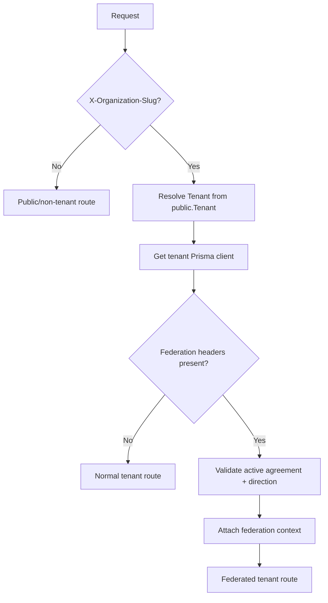
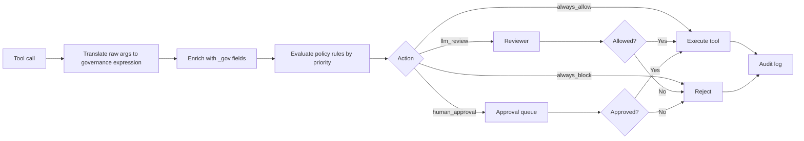
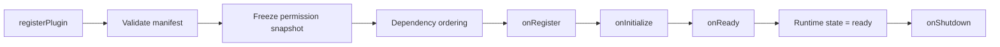
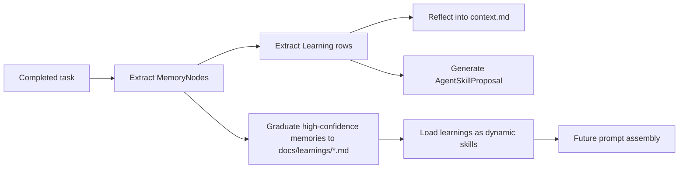

# Generic Corp Reimplementation Spec

This is a code-first technical spec for the current repository. When artifacts disagree, treat `server/`, `client/`, `packages/*`, and `server/prisma/schema.prisma` as the source of truth; some infra/docs assets lag the runtime.

## 1. Executive Summary

Generic Corp is a multi-tenant AI-agent orchestration platform.

Each organization gets:

- an agent roster and org chart
- task delegation and execution
- direct messaging and real-time chat
- a shared board/workspace
- memory, learning, and skill compounding
- governance and approval workflows
- credits/reputation/economy
- observability, alerting, and cost analytics
- optional federation with other organizations

The main runtime is the Claude Agent SDK, but the system abstracts runtime behind a provider so CLI and mock runtimes can be swapped in.

Scale of the current codebase:

- `40` Prisma models
- `10` built-in plugins
- `20+` dashboard routes
- `58` primary MCP tools in `server/src/mcp/server.ts`
- `11` auxiliary context/skill/file-memory MCP tools in `server/src/mcp/tools/*`
- plugin-contributed tools, routes, UI, hooks, and alerts on top

## 2. The Architectural Decisions That Matter

These are the non-optional ideas to preserve in a ground-up reimplementation:

1. **Tenant isolation is schema-per-tenant PostgreSQL**, not row-level tenancy.
2. **Operational state lives in Postgres, but agent-facing context lives on the filesystem**.
3. **Every agent invocation gets an embedded, task-scoped MCP server**.
4. **Tool access is filtered statically by role/level and dynamically by governance policy**.
5. **BullMQ + Redis is the active async execution backbone**.
6. **Socket.io is a first-class delivery path for real-time UX**.
7. **Plugins are a core extension model**, not a side feature.
8. **Learning/compounding is built into the runtime**, not an offline batch add-on.

## 3. Repository Layout

| Path | Purpose |
|---|---|
| `server/` | Hono API, Socket.io hub, BullMQ workers, Prisma, runtime bootstrap |
| `client/` | Vite + React dashboard |
| `packages/core/` | Plugin host, prompt assembly, registries, event bus, MCP factory |
| `packages/sdk/` | Plugin/provider contracts and extension interfaces |
| `packages/shared/` | Shared domain types, constants, runtime contracts |
| `packages/plugins-base/` | Built-in plugin implementations |
| `apps/landing/` | Separate landing-page app |
| `e2e/` | Playwright suites |
| `infrastructure/` | Terraform, K8s, Prometheus, Grafana, deployment assets |
| `frontend-mockup/`, `plans/`, `research/`, `docs/` | Supporting/reference material, not core runtime |

## 4. Technology Stack

### Backend

- Node `>=22`
- TypeScript
- Hono
- Prisma
- PostgreSQL
- `pgvector`
- Redis
- BullMQ
- Socket.io
- OpenTelemetry export support
- Prometheus metrics
- Zod validation

### Frontend

- React `18`
- Vite
- TanStack Router
- TanStack Query
- Zustand
- Socket.io client
- XYFlow / React Flow
- Mermaid
- jsPDF

### Runtime / AI

- `@anthropic-ai/claude-agent-sdk` as primary runtime
- CLI runtime adapter
- mock runtime for tests
- OpenAI-compatible embeddings API for vector generation, with deterministic local fallback

## 5. Storage Planes

| Plane | Stores | Why |
|---|---|---|
| **Postgres tenant schema** | agents, tasks, messages, chat state, memory graph, skills, governance, alerts, economy, observability | canonical structured org state |
| **Postgres public schema** | tenants, federation agreements/policies/audit | global cross-tenant registry |
| **Redis / BullMQ** | task queues and worker coordination | async execution |
| **Workspace filesystem** | `.gc/constitution.md`, `.gc/context.md`, `.gc/knowledge`, `.gc/skills`, `.gc/results`, board markdown, learnings, templates, file-backed agent memory | LLM-readable durable context |

This dual DB + filesystem model is one of the most important design choices in the repo.

## 6. Multi-Tenancy

### Model

- Public `Tenant` table tracks org slug, schema name, and lifecycle state.
- Each org gets its own schema like `tenant_<slug>`.
- New org schemas are cloned from a `_template` schema, which is itself synced from `public`.
- The server resolves tenant context from `X-Organization-Slug`.

### Runtime behavior

- Per-tenant Prisma clients are cached in an LRU cache of size `20`.
- Each client uses a low connection limit to avoid exhausting Postgres during parallel tests/provisioning.
- Org creation:
  - create `Tenant` row in `public`
  - provision schema
  - seed org data
  - start workers
  - start alert engine
- Org deletion:
  - stop alert engine
  - stop workers
  - clear cached tenant client
  - drop schema
  - delete `Tenant` row

### Client behavior

- Client stores the active org in Zustand + localStorage.
- Org switch:
  - clears query cache
  - resets app stores
  - reconnects Socket.io with new org scope
  - attaches `X-Organization-Slug` on non-public API calls

### Federation context

A second middleware layer can replace “local org only” behavior with negotiated cross-org access when:

- `x-federation-target` is present
- `x-federation-agreement` is present
- the agreement is active
- the negotiated direction permits access

## 7. Core Domain Model

### 7.1 Agents, Org, Workspace

- `Agent` — agent identity, role, department, level, status, tool permission overrides
- `OrgNode` — tree/hierarchy and canvas positions
- `Workspace` — org-level runtime settings, including encrypted LLM settings
- `ToolPermission` — named coarse-grained permission catalog
- `McpServerConfig` — registered external MCP servers
- `FeatureFlag` — tenant-local feature overrides

### 7.2 Task Execution

- `Task` — parent/child task graph, assignee/delegator, budgets, routing mode, verification policy/result
- `TaskActivity` — human-readable audit trail of task changes
- `TaskBid` — bidding model exists in schema but public runtime surfacing is limited
- `TaskReview` — quality review of completed work

### 7.3 Messaging and Chat

- `Message` — direct/system/chat messages with attachments and edit history
- `MessageFeedback` — thumbs up/down and emoji feedback
- `ChatTurn` — streaming turn state within a thread
- `ChatActivity` — tool/delegation/system activity rows inside a turn
- `ChatThreadState` — workflow status
- `ChatThreadPreference` — pin/star by actor
- `ChatThreadShareLink` — share token, secret, expiry

Important modeling choice: there is **no first-class `ChatThread` table**. Thread identity is an emergent string used across `Message` and `ChatTurn`, with auxiliary thread-scoped tables layered on top.

### 7.4 Economy and Reputation

- `CreditAccount`
- `CreditTransaction`
- `AgentReputation`

### 7.5 Skills and Compounding

- `AgentSkill`
- `AgentSkillRevision`
- `AgentSkillProposal`
- `Learning`
- `CompoundingMetric`

### 7.6 Memory Graph

- `MemoryNode`
- `MemoryEdge`
- `MemorySnapshot`

### 7.7 Governance

- `GovernancePolicy`
- `GovernanceAuditLog`
- `GovernanceApprovalRequest`

### 7.8 Observability and Alerts

- `TraceSpan`
- `AlertRule`
- `AlertEvent`

### 7.9 Public-Schema Federation

- `Tenant`
- `FederationAgreement`
- `FederationPolicy`
- `SharedAgentListing`
- `CrossOrgTask`
- `FederationAuditLog`

## 8. Agent and Task Runtime

### 8.1 Startup sequence

At server boot, the system:

1. loads built-in plugin bootstrap definitions
2. instantiates `PluginHost`
3. runs plugin lifecycle
4. wires runtime/identity/economy/reputation/communications services
5. ensures `pgvector`
6. syncs tenant schemas
7. creates Hono app + Socket.io server
8. initializes workspace root
9. starts compounding loop
10. starts BullMQ workers
11. starts stuck-agent checker
12. starts idle-agent nudger
13. starts trace collector
14. optionally starts OTLP exporter
15. starts alert engine for each active tenant

### 8.2 Background task execution

Tasks are executed by BullMQ workers per tenant queue (`gc-<org>-tasks`).

### Task execution flow

1. Task is created in DB.
2. If status is `pending`, enqueue BullMQ job.
3. Worker loads task + assignee.
4. Worker marks agent `running`.
5. Worker assembles context:
   - soul / constitution
   - model preferences
   - delegation preferences
   - `.gc/context.md` summary
   - `.gc/knowledge` docs
   - org reports / peers / manager / unread messages
   - recent board items / blockers / task history
   - reputation / credits
   - relevant DB memories
   - governed workspace context
   - checkpoint snapshot
6. Worker captures checkpoint before invoking runtime.
7. Worker creates per-task embedded MCP server.
8. Runtime emits tool/message/thinking/result stream.
9. Worker records spans, chat activities, DB updates, and websocket events.
10. On completion:
    - maybe finalize task
    - maybe retry verification
    - clear checkpoint
    - write child results to parent workspace
    - extract memories
    - extract learnings
    - reflect back into `.gc/context.md`
    - generate skill proposals
    - settle credits
    - update reputation
    - maybe queue thread summary

```mermaid
flowchart LR
A[Task row created] --> B[BullMQ enqueue]
B --> C[Worker loads task]
C --> D[Load DB + workspace context]
D --> E[Capture checkpoint]
E --> F[Build system prompt]
F --> G[Create embedded MCP server]
G --> H[Invoke runtime provider]
H --> I[Tool/message/result events]
I --> J[DB updates + spans + websocket]
J --> K[Finalize task]
K --> L[Memory extraction]
L --> M[Learning extraction]
M --> N[Context/skill reflection]
N --> O[Economy settlement]
O --> P[Reputation update]
```

### 8.3 Interactive chat runtime

Interactive chat is separate from background tasking:

- chat with the **main agent** (`main`) is real-time and websocket-driven
- chat with **non-main agents** is message-driven and turned into background tasks

### Main agent path

`MainAgentStreamService`:

- persists user message + `ChatTurn`
- loads recent thread history
- assembles same style of prompt/context as task workers
- invokes runtime with embedded MCP
- streams `turn_start`, `text_delta`, `thinking_delta`, `tool_start`, `tool_result`, `turn_complete`, `turn_error`
- persists assistant message and chat activities

### Non-main agent path

`POST /messages` to a non-main agent:

- creates a `Message`
- creates a `Task` instructing the agent to respond via `send_message`
- enqueues that task

So “direct message to a worker agent” is implemented as an async task, not live chat.

## 9. Workspaces and File Semantics

Each org workspace is rooted at:

- `orgs/<slug>/`

Each agent workspace is under:

- `orgs/<slug>/employees/<agentName>/`

Each agent gets `.gc/` with:

- `constitution.md` — standing identity / soul
- `context.md` — mutable working memory
- `knowledge/*.md` — reference docs
- `skills/*.md` — personal skillbook
- `results/*.md` — delegated task outputs
- `memory/*.json` — file-backed local memory
- `model-preferences.json`
- `delegation-preferences.json`
- `checkpoint.json` — transient resumption snapshot

Org-shared workspace areas include:

- `board/status-updates`
- `board/blockers`
- `board/findings`
- `board/requests`
- `board/completed`
- `docs/learnings`
- `docs/digests`
- `templates`

### Why the filesystem matters

The workspace is not just persistence; it is part of the runtime contract:

- agents read/write it directly through coding tools
- prompt assembly summarizes it
- context selection ranks files from it
- board/learnings become durable, inspectable artifacts

### Artifact metadata

Every important workspace artifact can have a `.meta.json` sidecar tracking:

- creator
- access scope (`private` vs `org`)
- relevance score
- token estimate
- access count
- last accessed
- artifact kind

That metadata drives governed context selection.

### Board

Board items are markdown files, not DB rows.

Built-in item types:

- `status_update`
- `blocker`
- `finding`
- `request`

The server plugin adds:

- `decision_log`

Board types are plugin-extensible.

### Agent templates

Agent templates are also file-backed JSON, not Prisma models.

The repo ships starter templates such as:

- Research Analyst
- Code Reviewer
- Task Coordinator

Templates can be shared or tenant-local.

## 10. Prompt Assembly

`packages/core/src/prompt-assembler.ts` builds the system prompt.

Sections may include:

- agent identity/personality
- task prompt/context
- streaming vs task mode
- conversation history
- manager/reports/peers
- unread messages
- recent board items
- task history
- department summary
- reputation / credits
- relevant DB memories
- working context summary
- knowledge documents
- governed workspace context excerpts
- checkpoint resumption
- verification requirements
- execution budget
- dynamic skills and personal skill files

### Important prompt-side behavior

- The main agent is treated specially.
- The prompt explicitly teaches budget behavior.
- Verification policy is embedded into prompt instructions.
- File-backed context is summarized, not blindly dumped.
- Plugins can modify prompt build via hooks.

## 11. MCP Tooling Model

Every invocation gets an **embedded in-process MCP server** scoped to:

- one org
- one agent
- one task/turn

This server is the runtime’s “business toolbelt.”

### 11.1 Tool families

#### Primary inline tools (`58`)

- task orchestration: `delegate_task`, `finish_task`, `review_task_result`, `boost_task_priority`, `get_task`, `list_tasks`, `update_task`, `cancel_task`, `delete_task`, `get_my_budget`
- org/people: `get_my_org`, `list_org_nodes`, `discover_peers`, `list_agents`, `get_agent_status`, `create_agent`, `update_agent`, `delete_agent`, `create_org_node`, `update_org_node`, `delete_org_node`
- board: `query_board`, `post_board_item`, `update_board_item`, `archive_board_item`, `list_archived_items`, `get_task_board`
- messaging: `send_message`, `read_messages`, `list_threads`, `get_thread_summary`, `delete_thread`, `mark_message_read`, `delete_message`
- workspace/admin: `get_workspace`, `update_workspace`, `list_tool_permissions`, `get_tool_permission`, `create_tool_permission`, `update_tool_permission`, `delete_tool_permission`, `get_agent_tool_permissions`, `update_agent_tool_permissions`
- MCP infra admin: `list_mcp_servers`, `get_mcp_server`, `register_mcp_server`, `update_mcp_server`, `remove_mcp_server`, `ping_mcp_server`
- analytics/admin: `get_reputation`, `get_my_credits`, `get_leaderboard`, `get_agent_metrics`, `get_agent_system_prompt`, `list_organizations`, `create_organization`, `switch_organization`, `delete_organization`

#### Auxiliary tools (`11`)

- context: `list_available_context`
- skills: `propose_skill_update`
- file-backed memory: `memory_store`, `memory_retrieve`, `memory_update`, `memory_summarize`, `memory_discard`
- legacy aliases: `store_memory`, `recall_memories`, `recall_memory`, `forget_memory`

### Plugin tools

Registered at runtime through `McpServerFactory`.

### 11.2 Access filtering

Tool availability is filtered by:

- agent level (`ic`, `lead`, `manager`, `vp`, `c-suite`, `system`)
- role/department heuristics (infra/platform/security get more MCP-server access)
- explicit per-agent overrides in `Agent.toolPermissions`

Important distinction:

- **Tool permission filtering** decides whether the tool is visible/allowed at all.
- **Governance** decides whether a specific call with specific args is allowed right now.

## 12. Governance

Governance is a policy engine around tool execution.

### Policy model

Each `GovernancePolicy` has:

- priority
- enabled flag
- action
- predicates JSON
- optional review prompt / metadata

### Actions

- `always_allow`
- `always_block`
- `llm_review`
- `human_approval`

### Predicate categories

Built-ins include:

- tool match: `tool_is`, `tool_in`
- arg inspection: `arg_equals`, `arg_number_gt`, `arg_number_lt`, `arg_exists`
- context inspection: `context_equals`, `context_number_gt`, `context_number_lt`
- caller/org rules: `caller_level_in`, `caller_level_not_in`, `caller_is_self`, `caller_is_not_self`, `target_is_direct_report`, `target_is_not_direct_report`
- economic thresholds: `credit_balance_lt`, `reputation_lt`
- time/rate rules: `time_outside_range`, `rate_limit_exceeded`
- logical combinators: `all`, `any`, `not`, `always`, `never`
- plugin-defined custom predicates

### Governance translation

Tool args are enriched into `_gov_*` fields before evaluation, e.g.:

- `_gov_callerIsSelf`
- `_gov_targetIsDirectReport`
- `_gov_creditBudgetAmount`
- `_gov_callerLevel`

### Auditing and approvals

- every decision can produce `GovernanceAuditLog`
- human approval creates `GovernanceApprovalRequest`
- dashboard exposes policy list, policy impact, approvals, and audit search

## 13. Plugin System

The plugin system is central.

### 13.1 Lifecycle

- `onRegister`
- `onInitialize`
- `onReady`
- `onShutdown`

Plugins are dependency-ordered, and manifest permissions are frozen on registration.

### 13.2 Registration surfaces

Plugins can register:

- tools
- routes
- UI nav/pages/widgets/settings pages
- services
- hooks
- memory node types / extraction strategies
- board item types
- governance predicates
- alert rule types
- broadcast event names
- public plugin APIs

### 13.3 Permission model

Deny by default. Permissions include:

- `tools`
- `routes`
- `ui`
- `hooks`
- `memory`
- `board`
- `governance`
- `alerts`
- `events`
- `plugin-api`
- `services`
- `services:<type>`

A proxy context throws if a plugin uses a surface it did not declare.

### 13.4 Built-in plugins

Default bootstrap set:

- `local-env-vault`
- `local-sqlite-storage`
- `local-identity`
- `console-chat`
- `telegram`
- `discord`
- `gc-twilio`
- `gc-elevenlabs`
- `gc-server`
- `agent-economy`

Not all are enabled by default; some become enabled if configured.

## 14. Messaging, Threads, and Realtime

### 14.1 Message system

`Message` unifies:

- direct messages
- system messages
- chat messages

Features:

- attachments
- edit history
- feedback reactions
- read tracking

### 14.2 Thread model

Threads are string IDs shared across messages and turns.

Thread-level features:

- list/search/filter
- pin/star per actor
- workflow status (`active`, `waiting`, `needs_review`, `done`)
- fork from a prior turn
- export transcript as markdown or PDF
- share links with public/private mode, optional secret, expiry

### 14.3 Socket.io

Rooms are scoped by:

- org
- agent
- thread

Realtime event families include:

- chat stream events
- agent status changes
- task changes
- message changes
- board events
- reputation and credits events
- alert events
- plugin broadcast events
- presence updates

### 14.4 Presence

Browser clients publish viewer identity and heartbeat state.

Presence scopes:

- org-wide
- per-agent
- per-thread

The org chart and chat UI consume these presence feeds.

## 15. Tasks, Org Chart, and Agent Management

### Agents

Core agent fields live in DB, but some behavior/config lives in files:

- DB: name, displayName, role, department, level, status, personality snapshot
- files: soul/constitution, model preferences, delegation preferences, skills

Agent creation also provisions:

- credit account
- baseline reputation
- org node
- initial memory anchor

### Org chart

`OrgNode` stores:

- parent-child tree
- ordered position
- `positionX` / `positionY` for canvas/org-chart placement

Org APIs also expose delegation-flow analytics over recent tasks.

### Tasks

Key capabilities:

- hierarchical parent/child tasks
- assignee and delegator tracking
- priorities and board ordering
- routing modes: `hierarchical`, `adaptive`, `pool`, `broadcast`
- due dates and tags
- cost and turn budgets
- verification policy/result
- history/audit activities
- kanban board grouping

### Verification

Task verification supports:

- mode: `off`, `advisory`, `required`
- explicit commands with label, cwd, timeout
- persisted structured results
- retry path if verification fails after “completion”

### Deletion/archive flows

Agent deletion is guarded:

- impact preview endpoint
- archive vs delete modes
- org-node reparenting
- open task handling
- workspace archival

## 16. Memory, Learning, and Compounding

This repo has **two memory systems**.

### 16.1 Structured DB memory graph

`MemoryNode` / `MemoryEdge` / `MemorySnapshot`

Used for:

- semantic recall into prompts
- org-wide or agent-scoped knowledge graph browsing
- similarity matching via `pgvector`
- extraction from completed task traces

Built-in node types:

- `entity`
- `concept`
- `pattern`
- `fact`
- `procedure`

### 16.2 File-backed agent memory

Separate from the graph memory, each agent has `.gc/memory/*.json`.

Used by MCP `memory_*` tools.

Behavior:

- stores embedding + metadata in JSON
- semantic + lexical ranking
- access_count / freshness scoring
- summarize/discard/update operations

### 16.3 Learnings and compounding

After completed tasks:

1. memory extraction creates durable `MemoryNode`s
2. learning extraction creates pending `Learning` rows
3. context reflection rewrites `.gc/context.md`
4. skill reflection proposes edits to `.gc/skills/*.md`
5. compounding loop graduates high-confidence memory nodes into markdown learning files
6. learning markdown files are loaded as dynamic skills on future runs

## 17. Economy and Reputation

### 17.1 Credit economy

Per-agent `CreditAccount` tracks:

- current balance
- lifetime earned
- lifetime spent

`CreditTransaction` reasons include:

- `task_completed`
- `task_delegated`
- `task_failed_refund`
- `task_blocked_refund`
- `quality_bonus`
- `efficiency_bonus`
- `cycle_allocation`
- `reputation_dividend`
- `penalty_failure`
- `bid_placed`
- `bid_refunded`
- `priority_boost`
- `new_agent_bonus` is also used in service logic

Execution model:

- delegator can escrow credits for delegated work
- completion pays assignee
- failure/block returns partial refunds
- failure can also penalize assignee
- periodic cycle allocations can mint credits org-wide

### 17.2 Reputation

Reputation combines:

- completion rate
- rework rate
- cost efficiency
- duration efficiency
- reliability
- satisfaction (reviews + message feedback)

Scores are blended across:

- last 7 days
- last 30 days
- all time

Outputs include:

- overall score
- component scores
- skill score breakdown
- leaderboard
- history

## 18. Federation

Federation is implemented in the **public schema** because it crosses tenants.

### Agreement lifecycle

- `proposed`
- `accepted`
- `active`
- `suspended`
- `revoked`

### Policy shape

Negotiated scope covers things like:

- delegation direction
- billing model (`requester_pays`, `home_pays`, `split`)
- monthly caps
- approval requirements
- concurrency limits
- visibility constraints

### Public API currently exposed

- propose agreement
- list agreements
- get agreement
- accept agreement
- get policy
- upsert policy

### Important note

The schema also models:

- `SharedAgentListing`
- `CrossOrgTask`

Those indicate intended deeper cross-org execution, but the currently exposed HTTP/API surface is most complete around agreement/policy lifecycle rather than full shared-agent execution flows.

## 19. Observability and Alerts

### 19.1 Trace collection

`TraceCollector` buffers spans and flushes to `TraceSpan`.

Span types:

- `thinking`
- `tool_use`
- `tool_result`
- `delegation`
- `message`
- `prompt_build`
- `result`
- `status_change`
- `mcp_call`

The dashboard exposes:

- task spans
- agent spans
- cost attribution
- synthetic fallback traces if none were recorded

### 19.2 Metrics

Prometheus metrics include:

- websocket connections, latency, events
- HTTP request counts and durations
- task counts, cost, duration, tokens
- tool call counts and durations
- queue depth
- active agents
- prompt size
- alert fires
- rolling cost rate

### 19.3 OTLP

If `OTEL_EXPORTER_OTLP_ENDPOINT` is configured, trace spans are mirrored into OTLP.

### 19.4 Alert engine

Built-in rule types:

- `stuck_agent`
- `cost_spike`
- `delegation_depth`
- `error_rate`
- `queue_depth`

Custom rule types can be registered by plugins.

Alert data is persisted in:

- `AlertRule`
- `AlertEvent`

The UI supports rule CRUD and event acknowledgment/resolution.

## 20. HTTP API Surface

The server is a single Hono app mounted at `/api`, plus root-level health/metrics.

### 20.1 Public / cross-tenant routes

- `/health`
- `/health/live`
- `/health/ready`
- `/metrics`
- `/api/runtime-config`
- `/api/plugins/ui`
- `/api/plugins/routes`
- `/api/organizations`

### 20.2 Tenant-scoped core routes

- `/api/org`
- `/api/org/nodes`
- `/api/org/delegation-flows`
- `/api/agents`
- `/api/agent-templates`
- `/api/tasks`
- `/api/tasks/board`
- `/api/board`
- `/api/messages`
- `/api/chat/*`
- `/api/threads/*`
- `/api/tool-permissions/*`

### 20.3 Migrated/admin/analytics routes

- `/api/workspace`
- `/api/mcp-servers`
- `/api/economy/*`
- `/api/reputation/*`
- `/api/reviews`
- `/api/feature-flags/*`
- `/api/alerts/*`
- `/api/observability/*`
- `/api/memory/*`
- `/api/compounding/*`
- `/api/learnings/*`
- `/api/skill-proposals/*`
- `/api/agent-skills/*`
- `/api/channels/*`
- `/api/communications/*`
- `/api/governance/*`
- `/api/federation/*`

A reimplementation can keep this split or rationalize it, but must preserve the actual feature coverage.

## 21. Client Architecture

The dashboard is a React SPA with manual TanStack Router route composition.

### Major routes

- `/` — dashboard
- `/chat`
- `/org`
- `/board`
- `/economy`
- `/memory`
- `/compounding`
- `/costs`
- `/alerts`
- `/canvas`
- `/help`
- `/agents/:id`
- `/plugins/:pluginId`
- `/settings`
  - general
  - organization
  - feature flags
  - agents
  - MCP servers
  - skills
  - plugin settings
  - billing
  - security
  - governance
  - approvals
  - audit
  - notifications

### State management

- **TanStack Query** for server state
- **Zustand** for app/domain state:
  - chat
  - board
  - org
  - socket
  - plugin manifest
  - feature flags
  - economy
  - notifications
  - activity

### Plugin UI model

The client fetches `/api/plugins/ui` and dynamically integrates:

- nav items
- pages
- widgets
- settings pages
- tool display metadata
- message renderers
- theme overrides

### Feature flags

The client currently reads runtime config mainly for `canvas`.

## 22. Testing Strategy

### Unit / package tests

- Vitest in server, client, and packages
- server tests alias workspace packages to source files
- client tests use jsdom

### E2E

Playwright suites in:

- `agent`
- `board`
- `chat`
- `economy`
- `federation`
- `memory`
- `org`
- `plugins`
- `settings`
- `smoke`
- `tenant`
- `visual`
- `websocket`

E2E boot model:

- mock runtime server
- dashboard dev server
- deterministic browser tests

### Important commands

- `pnpm dev`
- `pnpm dev:server`
- `pnpm dev:client`
- `pnpm build`
- `pnpm typecheck`
- `pnpm test`
- `pnpm verify:packages`
- `pnpm test:e2e`
- `pnpm test:smoke`
- `pnpm test:visual`
- `pnpm db:generate`
- `pnpm db:push`
- `pnpm db:migrate`
- `pnpm db:seed`
- `pnpm docker:up`

## 23. Deployment and Operations

### 23.1 Local development

`docker-compose.yml` brings up:

- Postgres (`pgvector` image)
- Redis

### 23.2 Full/demo/prod assets

The repo also includes:

- `docker-compose.full.yml`
- `docker-compose.prod.yml`
- Terraform for AWS:
  - VPC
  - EKS
  - RDS Postgres
  - ElastiCache Redis
  - Secrets Manager
- K8s deployment example:
  - Deployment
  - Service
  - HPA
  - ServiceAccount
  - NetworkPolicy
- Prometheus + Grafana configs
- backup container in prod compose

### 23.3 Important runtime operational behavior

- graceful shutdown drains workers, socket hub, alert engines, compounding loop, trace exporter, plugin host, Prisma clients, queues
- queue depth is periodically sampled into Prometheus
- health endpoints exist both at root and `/api`
- `pgvector` support is actively verified at startup

## 24. Security Model

- trusted dashboard proxy token: `x-generic-corp-proxy-token`
- optional identity provider plugin handles bearer tokens, API keys, proxy auth
- websocket auth supports handshake token; query token is dev-only
- organization access is header-scoped, not inferred
- schema names are validated before DDL
- board/workspace/knowledge paths are guarded against traversal
- workspace LLM keys are encrypted in DB
- plugin capabilities are permission-scoped
- governance provides runtime policy enforcement on tools
- K8s example uses non-root containers and read-only root filesystem

## 25. Current Drift / Partial Surfaces

These matter for a reimplementation because not every repo artifact is equally current:

1. **Hono is current; Express is gone.**
2. **BullMQ is the active execution backbone.** Some deployment artifacts still mention Temporal; treat those as stale/alternate, not the runtime truth.
3. **Federation data model is richer than the currently exposed HTTP surface.**
4. **Task bidding is modeled in schema/economy but not fully surfaced as a first-class runtime workflow.**
5. **There are duplicate or overlapping admin/observability namespaces** (`/alerts` vs `/observability/alerts`).
6. **Some prompts/helper modules reference tooling that appears ahead of or adjacent to current MCP wiring.** Use actual MCP composition as the implementation truth.

## 26. Recommended Reimplementation Boundaries

If rebuilding from scratch, implement in this order:

1. **Core platform shell**
   - Hono app
   - health/metrics
   - public tenant registry
2. **Tenant isolation**
   - schema provisioning
   - tenant client cache
   - org CRUD
3. **Agent/workspace foundation**
   - agent CRUD
   - org tree
   - workspace manager
   - file-backed `.gc/` layout
4. **Task execution**
   - BullMQ
   - runtime provider abstraction
   - checkpointing
   - task board
5. **Embedded MCP**
   - per-task scoped server
   - tool filtering
   - core task/org/message tools
6. **Realtime UX**
   - Socket.io hub
   - chat streaming
   - presence
7. **Governance**
   - policy engine
   - audit logs
   - approvals
8. **Memory and compounding**
   - pgvector graph memory
   - file-backed memory
   - learning + skill proposal loop
9. **Economy/reputation**
   - credit settlement
   - score computation
10. **Federation and advanced plugins**
   - agreements/policies first
   - cross-org execution later if needed

## 27. Bottom Line

The repo is not “just an AI chat app.” It is a multi-tenant agent operating system with four equal pillars:

- **structured state** in Postgres
- **agent-readable workspace state** on disk
- **embedded MCP/governance/plugin runtime**
- **real-time orchestration and analytics**

A faithful reimplementation should preserve those pillars, even if individual APIs or UI pages are cleaned up.
